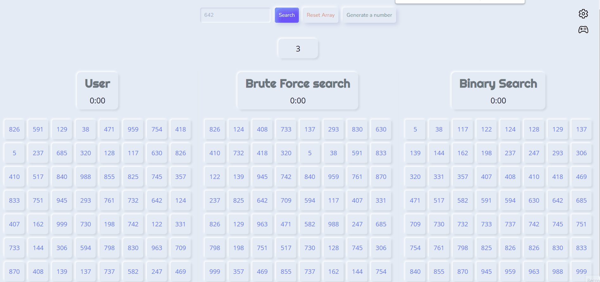

## Visualisation of algorithms (binary search and brute force)

#

## I believe this project will help others to have a big picture of these two algorithms and understand how to implement them.

#

## - The demostration of the project.

#

> 1. You should specify the number that needs to be found.
> 2. Click Search to start the program.
> 3. Click reset after finishing the program in order to be able to start it again.

#

## - You can also change some settings such as amount of numbers and the animation speed.

#

> 1. On the right top corner you can see some buttons, so click them in order to see settings
> 2. Choose desired settings and enjoy.

#

## So, you can clone this project and try to win these algorithms )).
